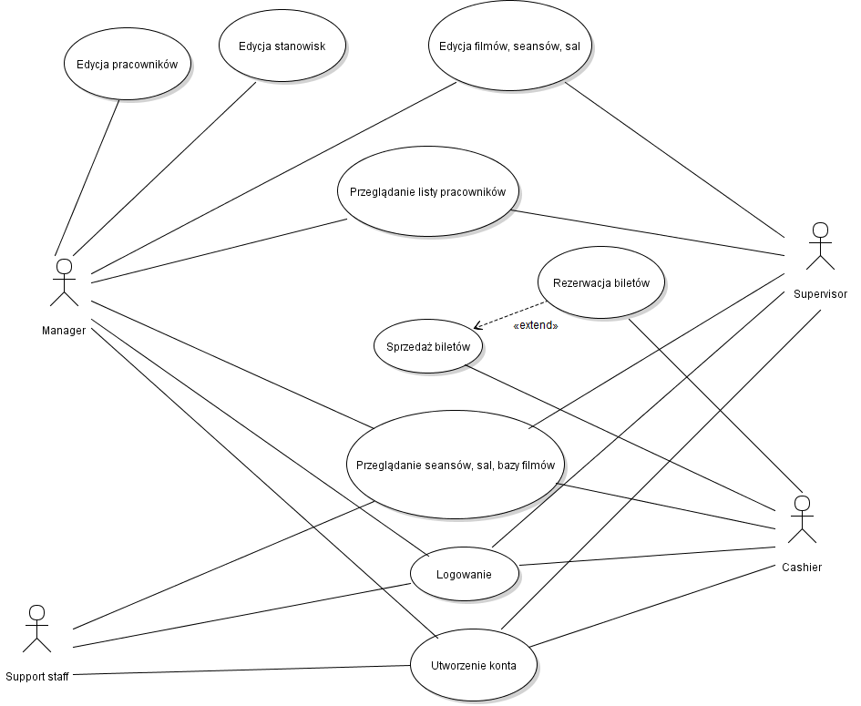

# Kompletny projekt systemu CinemaDGS

## Udokumentowane wymagania
### Wymagania funkcjonalne
|               Nazwa                 |               Opis                |
|-------------------------------------|-----------------------------------|
|Utworzenie konta                     |Pracownik ma możliwość utworzenia konta przy użyciu swoich danych
|Logowanie                            |Pracownik ma możliwość zalogowania się przy użyciu swojej nazwy użytkownika oraz hasła
|Nadanie stanowiska                   |Menadżer/kierownik ma możliwość nadania stanowiska każdemu z pracowników
|Zmiana stanowiska                    |Menadżer ma możliwość awansowania lub zdegradowania pracownika
|Kategorie pracowników                |Pracownicy są kategoryzowanie według stanowisk 
|Przeglądanie pracowników             |Menadżer ma możliwość przeglądania listy pracowników wraz z informacjami na ich temat
|Usuwanie pracowników                 |Menadżer ma możliwość usunięcia danego pracownika
|Dodawanie/usuwanie filmów            |Osoby o podwyższonych uprawnieniach mają możliwość dodawania oraz usuwania filmów
|Przeglądanie filmów                  |Pracownicy mają możliwość przeglądania filmów wraz z informacjami na ich temat
|Kategorie filmów                     |Filmy są kategoryzowane według gatunku
|Dodawanie/edytowanie/usuwanie sal    |Osoby o podwyższonych uprawnieniach mają możliwość dodawania, edytowania oraz usuwania sal
|Przeglądanie sal                     |Osoby o podwyższonych uprawnieniach mają możliwość przeglądania sal
|Dodawanie/edytowanie/usuwanie seansów|Osoby o podwyższonych uprawnieniach mają możliwość dodawania, edytowania oraz usuwania seansów
|Rezerwacja/sprzedaż biletów          |Osoby o konkretnych uprawieniach mają możliwość rezerwacji i sprzedaży biletów
|Limit sprzedaży biletów              |Pracownik nie może sprzedać więcej biletów niż jest wolnych miejsc na dany seans
### Wymagania niefunkcjonalne
|               Nazwa                 |               Opis                |
|-------------------------------------|-----------------------------------|
|Dostępność                           |Aplikacja będzie dostępna całodobowo oprócz przerw technicznych, które najczęściej realizowane będą  w godzinach nocnych
|Wydajność                            |Maksymalna ilość użytkowników korzystających z aplikacji będzie zdecydowanie przewyższać ilość aktualnych pracowników
|Wsparcie                             |Monitoring aplikacji??? Max czas naprawy Użytkownicy mogą zgłaszać błędy poprzez kontakt mailowy xD
|Bezpieczeństwo                       |Najważniejszym zagrożeniem, na które może być narażona aplikacja to wyciek danych. Sposoby zabezpieczenia

## Use-cases

