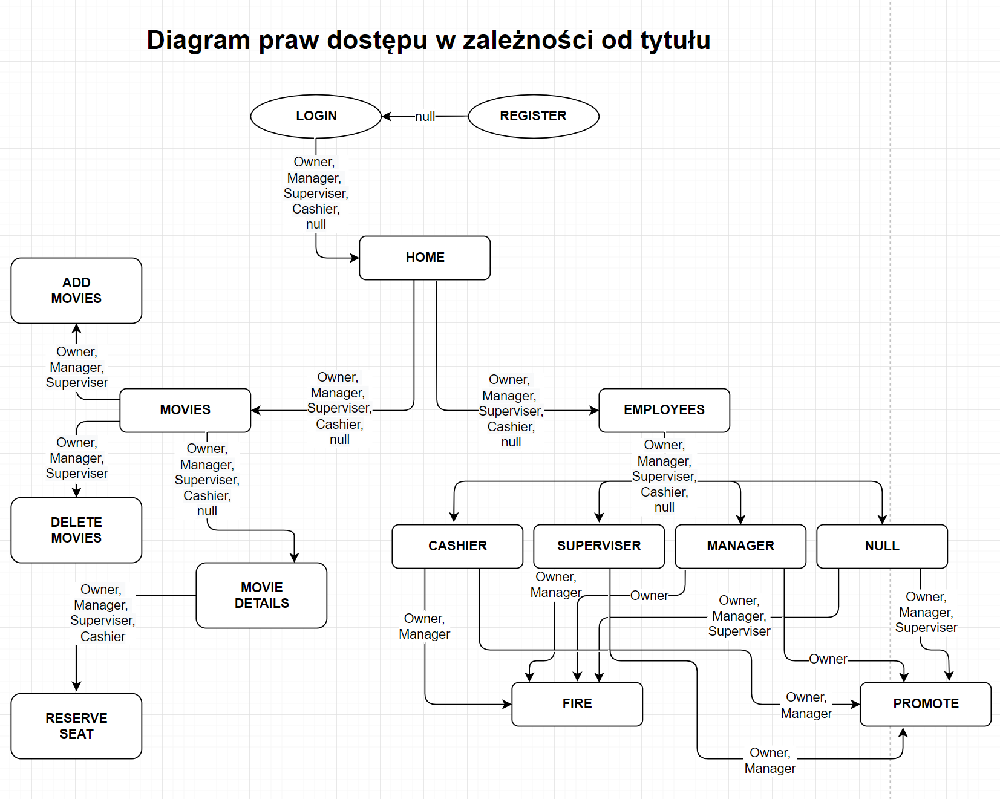

# Kompletny projekt systemu CinemaDGS

## Udokumentowane wymagania
### Wymagania funkcjonalne
|               Nazwa                 |               Opis                |
|-------------------------------------|-----------------------------------|
|Utworzenie konta                     |Użytkownik ma możliwość utworzenia konta przy użyciu swoich danych (Imię, Nazwisko, Username, Hasło)
|Logowanie                            |Użytkownik ma możliwość zalogowania się przy użyciu swojej nazwy użytkownika oraz hasła
|Nadanie stanowiska                   |Właściciel/Manadżer/Kierownik ma możliwość nadania stanowiska użytkowniku, który nie ma żadnego
|Kategorie pracowników                |Pracownicy są kategoryzowanie według stanowisk (Właściciel/Owner, Manadżer/Manager, Kierownik/Superviser, Cashier/Kasjer, Brak stanowiska/Null)
|Przeglądanie pracowników             |Właściciel/Menadżer/Kierownik ma możliwość przeglądania listy pracowników wraz z informacjami na ich temat
|Zmiana stanowiska                    |Właściciel/Manadżer ma możliwość awansowania lub zdegradowania pracownika (Manager nie może Managera)
|Usuwanie pracowników                 |Właściciel/Menadżer ma możliwość usunięcia danego pracownika (Manadżer nie może Manadżera)
|Przeglądanie filmów                  |Wszyscy użytkownicy mają możliwość przeglądania filmów wraz z informacjami na ich temat
|Kategorie filmów                     |Filmy są kategoryzowane według gatunku
|Dodawanie filmów                     |Właściciel/Menadżer/Kierownik ma możliwość dodawania filmów
|Usuwanie filmów                      |Właściciel/Menadżer/Kierownik ma możliwość usuwania filmów
|Przeglądanie sal                     |Właściciel/Menadżer/Kierownik/Kasjer ma możliwość przeglądania sal
|Dodawanie sal                        |Właściciel/Menadżer/Kierownik ma możliwość dodawania sal
|Edytowanie sal                       |Właściciel/Menadżer/Kierownik ma możliwość edytowania sal
|Usuwanie sal                         |Właściciel/Menadżer/Kierownik ma możliwość usuwania sal
|Rezerwacja miejsca w sali            |Właściciel/Menadżer/Kierownik/Kasjer ma możliwość rezerwacji wolnych miejsc
|Anulowanie rezerwacji miejsca w sali |Właściciel/Menadżer/Kierownik/Kasjer ma możliwość anulowania zarezerwowanych miejsc
|Dodawanie seansów                    |Właściciel/Menadżer/Kierownik ma możliwość dodawania, edytowania oraz usuwania seansów
|Edytowanie seansów                   |Właściciel/Menadżer/Kierownik ma możliwość dodawania, edytowania oraz usuwania seansów
|Usuwanie seansów                     |Właściciel/Menadżer/Kierownik ma możliwość dodawania, edytowania oraz usuwania seansów
|Sprzedaż biletów                     |Kasjer ma możliwość sprzedaży biletów
|Limit sprzedaży biletów              |Kasjer nie może sprzedać więcej biletów niż jest wolnych miejsc na dany seans
### Wymagania niefunkcjonalne
|               Nazwa                 |               Opis                |
|-------------------------------------|-----------------------------------|
|Dostępność                           |Aplikacja będzie dostępna całodobowo oprócz przerw technicznych, które najczęściej realizowane będą  w godzinach nocnych
|Wydajność                            |Maksymalna ilość użytkowników korzystających z aplikacji będzie zdecydowanie przewyższać ilość aktualnych pracowników
|Wsparcie                             |Monitoring aplikacji użytkownicy mogą zgłaszać błędy poprzez korzystanie z formularza kontaktowego
|Bezpieczeństwo                       |Najważniejszym zagrożeniem, na które może być narażona aplikacja to wyciek danych. Sposoby zabezpieczenia
## Lista wykorzystywanych technologii
|             Technologia             |            Uzasadnienie           |
|-------------------------------------|-----------------------------------|
|Python                               |wybraliśmy Python, ponieważ ma dosyć nowoczesną składnię języka, umożliwiwa korzystania z różnych paradygmatów programowania (obiektowego, funkcyjnego, reaktywnego) i jest duża ilość odpowiedzi na pytania na StackOverflow.
|Django (framework Pythona)           |wybraliśmy Django, ponieważ oferuje szybkie efekty (umożliwiając bardzo szybkie tworzenie aplikacji internetowych) i bezpieczeństwo (posiada wiele wbudowanych bibliotek dbających o bezpieczeństwo programu).
|PostgreSQL                           |wybraliśmy PostgreSQL, ponieważ zapewnia relacyjny model baz danych łącznie z obiektowym (dając najlepsze rozwiązania dla obu modeli), niezawodność, otwarte oprogramowanie.
|React (framework JavaScripta)        |wybraliśmy React, ponieważ jest jednym z najlepszych narzędzi do dynamicznego wyświetlania zawartości, a także zabezpiecza łatwą komunikację z backendem.
|SCSS (preprocesor CSSa)              |wybraliśmy SCSS, ponieważ jest bardziej rozszerzona wersją CSS, więc jest więcej dodatków w nim, a co najważniejsze mniej problemów przy Cross-Browser Testing).
## Use-cases

## Prawa dostępu

